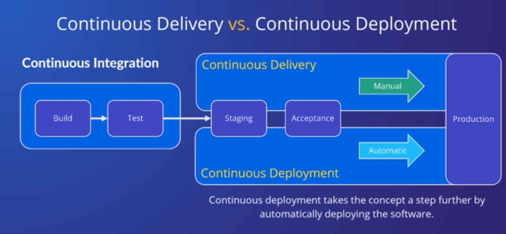

## ref
- [ref](https://cloudacademy.com/course/building-cicd-pipelines-with-gitlab-4492/introduction/)
## ci/cd
- jenkins,github actions,teamcity,gitlab ci/cd
- create a ci/cd pipeline capable of building,testing and deplying a web app
-  Continuous integration consists of a set of practices and tools used to automate the integration of code changes into a single shared repository.
- Continuous delivery and continuous deployment are practices used to automate the release of software. 
- The distinction between continuous delivery and continuous deployment is subtle. - Continuous delivery is the practice of enabling the release of software at any time.
- continuous deployment is the practice of releasing software automaticall
- gitlab-the most comprehensive devsecops platform:availble as saas 


- each project in gitlab has its own ci/cd pipeline and repo
- adding a remote 
`git remote add <remote name> <remote url>`
`git push --set-upstream <> <>`
- the ci/cd pipeline will run on each commit
- ex:The build stage is responsible for taking the Python application code and producing a Python distribution package. The package will be uploaded to a package registry and stored as a build artifac
- .gitlab-ci.yml
- 
```
The top-level key represents the user-defined name of the job, and I've named this job pypackage_build_and_upload.
 Jobs are run inside of a runner. 
 Runners execute jobs in either a shared or dedicated environment.
  The SaaS-based GitLab environment provides a pool of shared runners.
   Runners execute jobs in a specific runtime environment, referred to as an executor. We'll be using the Docker executor in this lesson.
    The image key instructs GitLab to run the job inside the latest version of the Python image. 
    This provides the application with the runtime environment needed to build the Python distribution package. 
    The stage key defines the job as part of the build stage. 
    GitLab includes the default stages of build, test, and deploy, though it also supports custom stages, which we'll see in another video.
     The script key defines the commands to be executed by the job. This job installs the Build and Twine Python packages.
build artifacts are used to pass data from one job to other
```

- artifacts tells the files to be saved by the job
- script tells the commands to run
- docker in docker :need to mention at top level
- build ,test,depoly :default stagess,we can specify custom stages as well by stages: at top
## continuous delivery
- Continuous delivery is a practice where software is built, tested, and prepared for deployment in an automated and repeatable manner. 
- It focuses on ensuring that software is always in a releasable state, always ready for deployment.
- Software is delivered to a staging or production-like environment, allowing for manual approval or some form of additional testing before final deployment. 
### continuous deployment
- Continuous deployment takes that entire concept just one step further by automatically deploying the software to a production environment as soon as the necessary checks and tests have passed.



`git revert HEAD` - to revert last commit
## Docker
[ref](https://cloudacademy.com/course/introduction-to-docker-2/the-docker-architecture-1/?context_id=129&context_resource=lp)
- Docker is a container platform that allows you to separate your application from the underlying infrastructure by bundling up your code and all of its dependencies into a self-contained entity that will run the same on any supported system


- docker daemon:server:manages docker objects(images,containers,networks)
- The daemon exposes a REST API that the client consumes over UNIX sockets or a network interface

- the client is docker  binary

- namespaces, which allow you to isolate system resources.


`sudo systemctl start/status docker`


- docker ps -a ,docker ps,docker images 
- scratch->docker image ,run some commands,to see them we can go to /var/lib/docker/images/imagedb/content/sha256

- to start a container by name we can `docker start <name from docker ps -a>`


- `docker rm `to remove one
- `cmd`- the default command to run when runnign a container from image
- `docker rmi <image id>` remove image
- `docker build -t <image name > .`


- var/lib/docker/image/overlay/imagedb/content/sha256
- docker allows you to create an image based on an existing container by using the commit command.

It also allows you to change instructions using the change flag

-  By default, Docker containers run inside of their own network, called the bridge network
- to see the networking ip used by container we can`docker inspect <container id>`
- and we can access the ip 


bridge would mean: In terms of Docker, a bridge network uses a software bridge which lets containers connected to the same bridge network communicate, while providing isolation from containers that aren't connected to that bridge network.
ctrl+p ,ctrl+q to come out of container(detach without stoppign)


# docker compose


